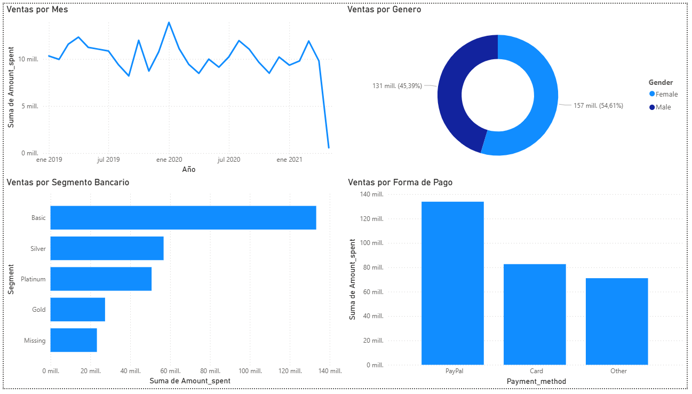

# 🧠 Ventas en Tienda Online – Exploratory Data Analysis (EDA)

Este proyecto realiza un análisis exploratorio de datos sobre un conjunto de transacciones de clientes de una tienda online. El objetivo es entender el comportamiento de los clientes a lo largo del tiempo y detectar patrones relevantes para la toma de decisiones de negocio.

---

## 📦 Dataset

- Total de registros: **2,512**
- Columnas clave:
  - `Transaction_date`
  - `Age`
  - `Gender`
  - `Employees_status`
  - `Segment`
  - `Payment_method`
  - `Amount_spent`

---

## 🛠️ Tecnologías utilizadas

- Python 3
- Pandas
- Matplotlib
- Jupyter Notebook
- Power BI 

---

## 🧼 Proceso de limpieza

- Conversión de fechas a formato `datetime`.
- Relleno de valores nulos:
  - `Gender`, `Employees_status`: `"Undefined"`
  - `Age`: `-1` si era desconocida
  - `Referal`: `0`
- **Eliminación** de registros con `Amount_spent` nulo.
- Creación de columna `Month` para análisis temporal.

---

## 📊 Análisis realizado

- Tendencia de ventas por mes
- Número de transacciones mensuales
- Relación entre edad y gasto
- Comparación de gasto por género

---

## 📁 Archivos generados

- `online_store_customer_data_cleaned.csv` – datos limpios listos para Power BI.
- `ventas.ipynb` – notebook con todo el análisis en Python.

---

## 📈 Gráfico de Power BI

Este panel incluye los siguientes gráficos:

- 📅 Ventas por mes  
- 👥 Ventas por género  
- 🏦 Ventas por segmento bancario  
- 💳 Ventas por forma de pago

## 📌 Conclusión

El análisis exploratorio permitió identificar comportamientos claves en los clientes y patrones de gasto que pueden ser usados para mejorar campañas de marketing, segmentación de clientes y optimización de ventas por canal o región.
